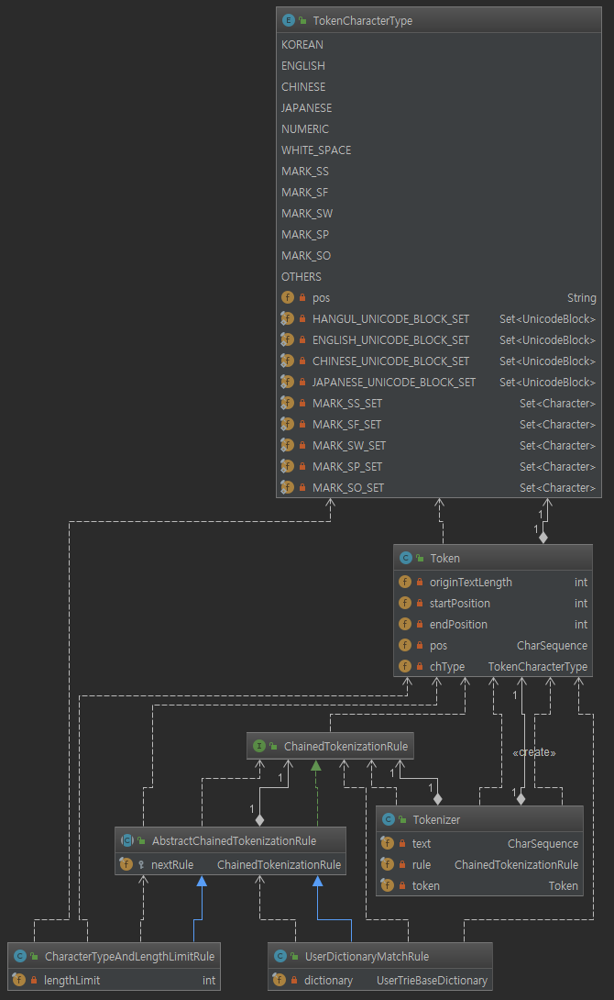
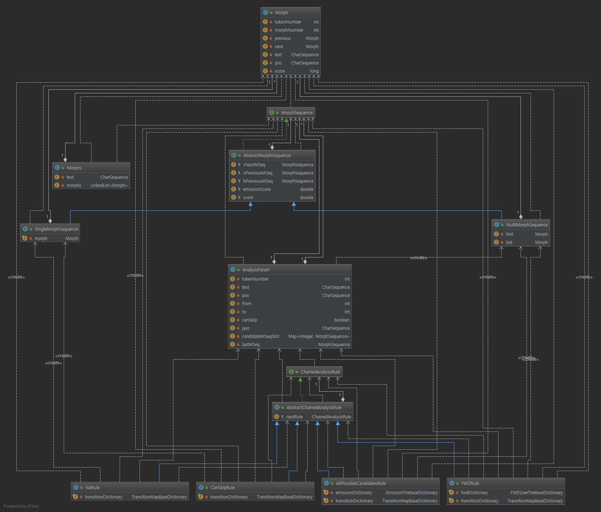

# 1. KLAY
[](https://travis-ci.com/ks-shim/klay)
[](https://coveralls.io/github/ks-shim/klay?branch=master)
[  ](https://bintray.com/dwayne/nlp/klay/_latestVersion)

**K**orean **L**anguage **A**nal**Y**zer using KOMORAN's dictionaries.
- korean morphology analysis
- 한국어 형태소 분석기 입니다.
- 개발 시작일 : 2019. 02 ~
  - version : 0.1 (2019.02.26)
- KOMORAN의 사전을 기반으로 분석하며, 사용하는 Data structure와 분석 방식은 상이합니다.
- Data Structure : KLAY의 분석 방식에 맞게 수정한 Lucene의 Trie를 사용합니다.
- KLAY is a thread-safe analyzer. (멀티 쓰레드 환경에서의 사용을 권장합니다.)


# 2. Architecture
Performance와 동시에 확장성을 고려하였으며 Readability에 많은 신경을 썼습니다. 그래서 조금 더 자바(Java)스럽게 Design하였습니다.
## 2-1. Tokenization
Chain of Responsibiility 패턴을 사용하여 구현하였습니다. ChainedTokenizationRule 인터페이스를 구현하여 Rule을 쉽게
추가할 수 있습니다. 현재는 아래와 같은 Rule을 순차적으로 적용하고 있습니다.
 - UserDictionaryMatchRule : 사용자 사전에 매칭하는 Rule
 - CharacterTypeAndLengthLimitRule : 문자타입 및 길이 제한 Rule



## 2-2. Analysis
마찬가지로 Chain of Responsibility 패턴을 사용하여 구현하였습니다. ChainedAnalysisRule 인터페이스를 구현하여 Rule을 쉽게
추가할 수 있습니다. 현재는 아래와 같은 Rule을 순차적으로 적용하고 있습니다.
 - CanSkipRule : 분석없이 생략할 수 있는 Rule
 - FWDRule : 기분석 사전으로 Fully 매칭하는 Rule
 - AllPossibleCandidateRule : 미등록어 추정 Rule
 - NARule : 분석 불가 Rule
HMM(Viterbi)는 MorphSequence 클래스를 사용하여 계산되어집니다.



# Example
```java
    //***********************************************************************
    // 1. configuration and creating Klay object ...
    //***********************************************************************
    Klay klay = new Klay(Paths.get("data/configuration/klay.conf"));

    //***********************************************************************
    // 2. start morphological analysis.
    //***********************************************************************
    String text = "너무기대안하고갔나....................재밌게봤다";
    Morphs morphs = klay.doKlay(text);

    //***********************************************************************
    // 3. print result.
    //***********************************************************************
    Iterator<Morph> iter = morphs.iterator();
    while(iter.hasNext()) {
        System.out.println(iter.next());
    }
```
